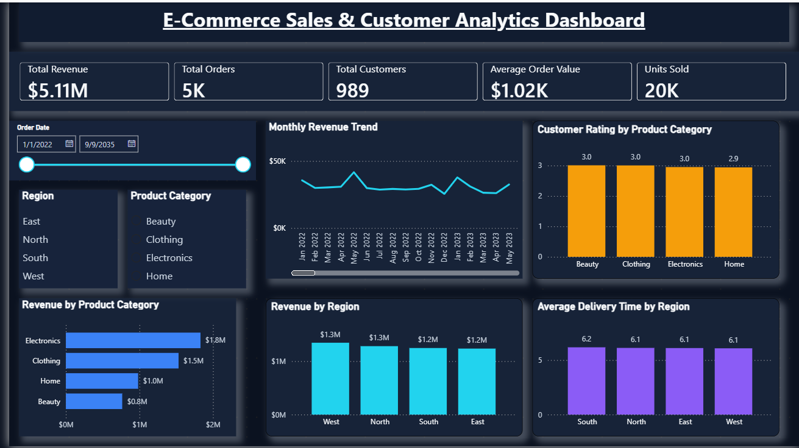

# E-Commerce_Sales_Customer_Analytics_Dashboard
Interactive Power BI dashboard for analyzing e-commerce sales, customers, product performance, regional reve# 🛒 E-Commerce Sales & Customer Analytics Dashboard

## 📌 Project Overview

This project presents an interactive **Power BI dashboard** designed to analyze e-commerce sales performance, customer behavior, product categories, regional performance, customer ratings, and delivery efficiency.

The objective of this project is to transform raw e-commerce data into meaningful business insights that can support data-driven decision-making.

---

## 📊 Dashboard Preview

---

## 🎯 Key KPIs

* **Total Revenue:** $5.11M
* **Total Orders:** 5K
* **Total Customers:** 989
* **Average Order Value:** $1.02K
* **Units Sold:** 20K

---

## 📈 Dashboard Analysis

### 1. Monthly Revenue Trend

Analyzes revenue performance over time and helps identify changes and fluctuations in monthly sales.

### 2. Revenue by Product Category

Compares revenue generated across different product categories.

### 3. Revenue by Region

Evaluates regional sales performance and identifies the highest-performing regions.

### 4. Customer Rating by Product Category

Compares average customer ratings across product categories to understand customer satisfaction.

### 5. Average Delivery Time by Region

Analyzes delivery performance across regions and helps identify differences in delivery efficiency.

---

## 🔍 Key Insights

* **Electronics** generated the highest revenue among all product categories.
* **Clothing** was the second-highest revenue-generating category.
* Regional revenue was relatively balanced, with the **West region** generating the highest revenue.
* Customer ratings remained close to **3.0** across most product categories.
* Average delivery time remained approximately **6 days** across regions.
* The dashboard allows users to dynamically analyze performance using **Date, Region, and Product Category filters**.

---

## 🛠️ Tools & Technologies

* **Power BI**
* **Power Query**
* **DAX (Data Analysis Expressions)**
* **Data Cleaning & Transformation**
* **Data Visualization**
* **Business Intelligence**

---

## ⚙️ DAX Measures

Key measures created for this dashboard include:

* Total Revenue
* Total Orders
* Total Customers
* Average Order Value
* Total Quantity Sold
* Average Customer Rating
* Average Delivery Days

---

## ✨ Dashboard Features

* Interactive slicers and filters
* KPI cards
* Time-series revenue analysis
* Product category analysis
* Regional performance analysis
* Customer satisfaction analysis
* Delivery performance analysis
* Interactive and user-friendly dashboard design

---

## 📁 Repository Files

* `E-Commerce_Sales_Customer_Analytics_Dashboard.pbix` — Power BI dashboard file
* `E-Commerce_Sales_Customer_Analytics_Dashboard.png` — Dashboard preview
* `README.md` — Project documentation

---

## 💡 Business Objective

The dashboard helps stakeholders quickly understand overall sales performance, identify high-performing product categories and regions, monitor customer satisfaction, and evaluate delivery efficiency.

---

## 👤 Author

**Aishwary Chavan**

Data Analytics | Power BI | Python | SQL | Excel
nue, ratings, and delivery performance.
